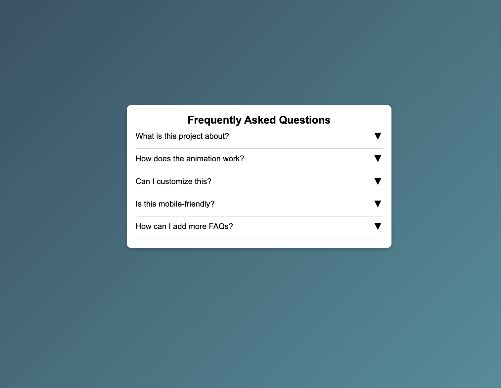

# Dy 11: FAQ Toggle with Smooth Animations

## 📌 Project Overview
This project is a **toggleable FAQ section** where users can click on a question to reveal or hide the answer with smooth animations. The design is clean, responsive, and visually appealing.

## 🎯 Features
✅ Smooth expand/collapse animation  
✅ Fully responsive design  
✅ Minimal and elegant UI  
✅ Easy to customize (colors, fonts, questions)  
✅ No external libraries required  

## 🛠️ Technologies Used
- HTML
- CSS (with transitions for smooth effects)
- JavaScript (for toggling answers)

---

# Demo page

Click [Here](https://ayshasanyang.github.io/Day-11-toggleable-FAQ-section/) to view the page

## 🚀 How to Run
1. Download or clone the repository
```bash
git clone https://github.com/ayshasanyang/Day-11-toggleable-FAQ-section.git
```
2. Navigate to the project folder.
3. Open the project files in your vscode or any code editor of your choice
4. Open the `index.html` file in your web browser.

---
## 📸 Screenshots


## 📸 Preview


---

## 📢 Connect

If you enjoyed this project, let me know! Follow me on social media to see more coding content:

- Instagram: [@codewithaysha](#)
- TikTok: [@Aysha](#)

---